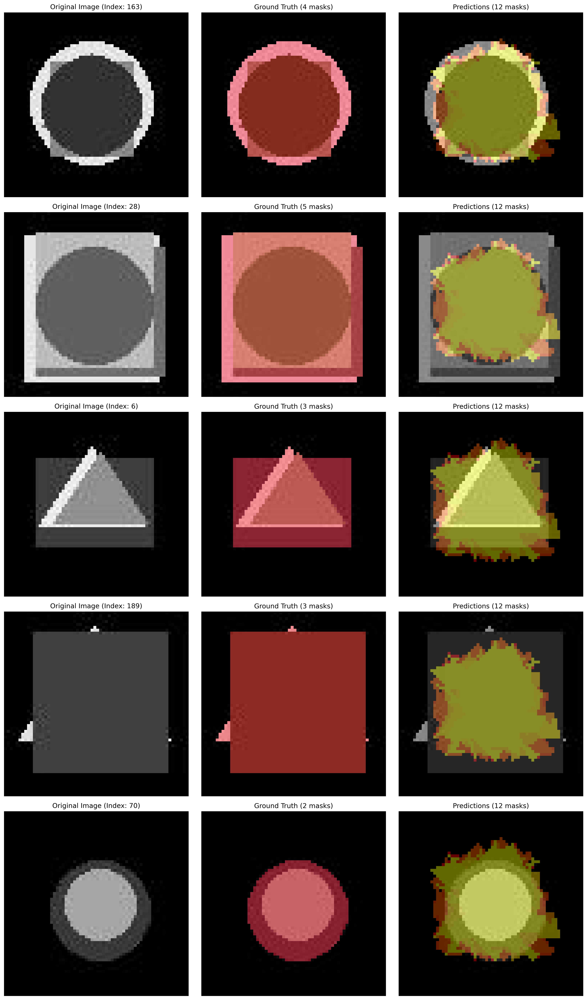
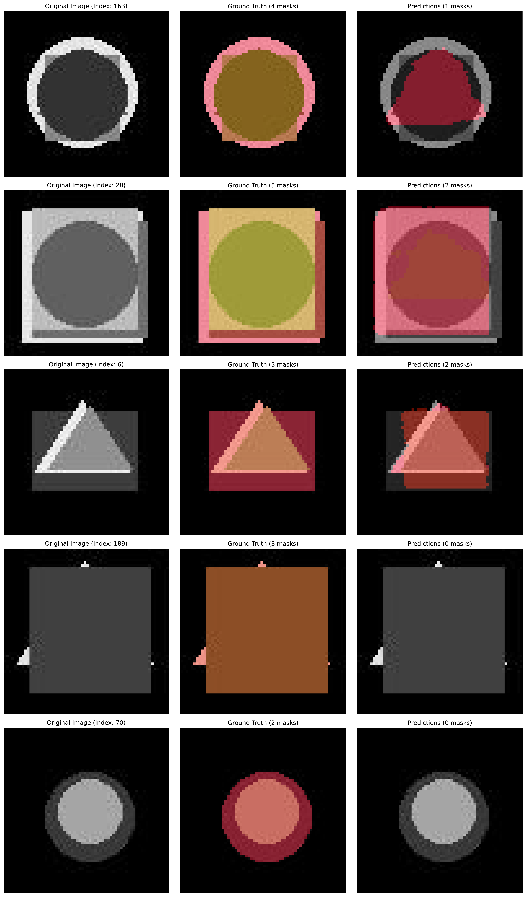
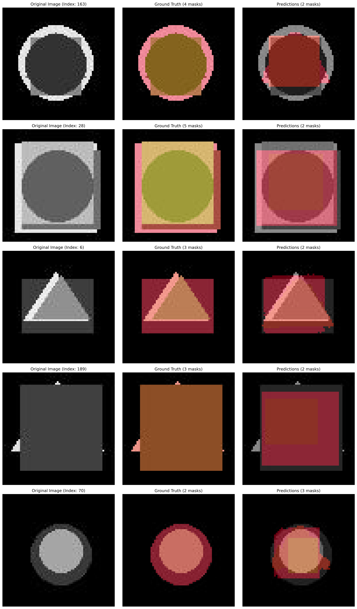

# OmniSeg

A versatile, semi-supervised instance segmentation framework built on PyTorch Lightning. OmniSeg enables training with various state-of-the-art backbones and segmentation heads, including a novel contour-based approach, on the COCO dataset. It's designed for flexibility, allowing researchers and developers to easily experiment with different model architectures and training strategies.

## ✨ Features

- **Semi-Supervised Learning (SSL):** Leverages a teacher-student model architecture to use both labeled and unlabeled data, a crucial technique for training with limited annotations.
- **Flexible Backbones:** Supports a wide range of popular vision models as backbones, including:
  - **ViT:** DINO, SAM
  - **CNN:** ResNet, ConvNeXt, RepVGG
  - **Hybrid:** Swin Transformer
  - **Test:** Simple CNN backbone for testing and development
- **Modular Segmentation Heads:**
  - **Mask R-CNN:** The classic, widely-used two-stage detector.
  - **ContourFormer:** A custom head that predicts object contours directly.
  - **Deformable DETR:** Advanced DETR-based segmentation head.
- **PyTorch Lightning:** Simplifies boilerplate code, ensures reproducibility, and supports distributed training.
- **Automated Data Handling:** Automatically downloads and prepares the COCO 2017 dataset, or use the tiny synthetic dataset for quick testing.

## 🚀 Getting Started

### Prerequisites

- Python 3.8+
- NVIDIA GPU with CUDA (recommended)

### Installation

Clone the repository:

```bash
git clone https://github.com/DolosLabs/omniseg.git
cd omniseg
```

Install dependencies:

```bash
pip install -r requirements.txt
```

Prepare the tiny dataset (recommended for testing):

```bash
python generate_tiny_data.py
```

Or prepare the COCO 2017 dataset:  
The script automatically handles the download and extraction of the COCO 2017 dataset when you first run it.

## 💻 Usage

To train a model, use the `train.py` script with command-line arguments.

### Basic Training

```bash
# Example 1: Quick test with working combination
python train.py --backbone simple --head deformable_detr --use_tiny_data --fast_dev_run

# Example 2: Train with COCO dataset (requires network access)
python train.py --backbone resnet --head maskrcnn

# Example 3: Train with tiny dataset for development
python train.py --backbone dino --head maskrcnn --image_size 64
```

### Advanced Configuration

| Argument              | Type   | Default | Description |
|------------------------|--------|---------|-------------|
| `--backbone`           | str    | dino    | Backbone model (dino, sam, swin, convnext, repvgg, resnet). |
| `--head`               | str    | mask2former | Segmentation head (mask2former, maskrcnn, contourformer). |
| `--learning_rate`      | float  | 5e-5    | Learning rate. |
| `--image_size`         | int    | None    | Custom image size. |
| `--batch_size`         | int    | None    | Batch size per GPU. |
| `--num_labeled_images` | int    | -1      | Number of labeled images (-1 for all). |
| `--num_unlabeled_images`| int   | -1      | Number of unlabeled images (-1 for all). |
| `--fast_dev_run`       | flag   | False   | Run a single batch for testing. |
| `--warmup_steps`       | int    | 500     | Steps to train on labeled data only before unsupervised loss. |
| `--unsup_rampup_steps` | int    | 5000    | Steps to ramp up unsupervised loss weight. |
| `--use_tiny_data`      | flag   | False   | Use tiny synthetic dataset. |

Example:

```bash
python train.py --backbone simple --head deformable_detr --use_tiny_data --fast_dev_run
```

## 🧪 Testing Status

| Backbone   | Head           | Status  | Notes |
|------------|----------------|---------|-------|
| simple     | maskrcnn       | ✅ Working | Ready for training. |
| simple     | contourformer  | ✅ Working | Ready for training. |
| simple     | deformable_detr| ✅ Working | Ready for training. |
| dino       | maskrcnn       | ✅ Working | Ready for training. |
| dino       | contourformer  | ✅ Working | Ready for training. |
| dino       | deformable_detr| ✅ Working | Ready for training. |
| sam        | maskrcnn       | ❌ Failed | Input size mismatch (64x64 vs 1024x1024). |
| sam        | contourformer  | ❌ Failed | Input size mismatch (64x64 vs 1024x1024). |
| sam        | deformable_detr| ❌ Failed | Input size mismatch (64x64 vs 1024x1024). |
| swin       | maskrcnn       | ❌ Failed | Tensor shape mismatch. |
| swin       | contourformer  | ❌ Failed | Tensor shape mismatch. |
| swin       | deformable_detr| ❌ Failed | Tensor shape mismatch. |
| convnext   | maskrcnn       | ✅ Working | Ready for training. |
| convnext   | contourformer  | ✅ Working | Ready for training. |
| convnext   | deformable_detr| ✅ Working | Ready for training. |
| repvgg     | maskrcnn       | ✅ Working | Ready for training. |
| repvgg     | contourformer  | ✅ Working | Ready for training. |
| repvgg     | deformable_detr| ✅ Working | Ready for training. |
| resnet     | maskrcnn       | ✅ Working | Ready for training. |
| resnet     | contourformer  | ✅ Working | Ready for training. |
| resnet     | deformable_detr| ✅ Working | Ready for training. |

## 🖼️ Visualization

```bash
python visualize_model.py path/to/your/checkpoint.ckpt
```

This saves `model_predictions_viz.png` in the same directory.
### Example Outputs

Here are some sample predictions from different backbones and heads just trained for 5-9 epochs:

| Backbone | Head          | Example Output |
|----------|---------------|----------------|
| DINO     | ContourFormer |  |
| RepVGG   | Mask R-CNN    |  |
| DINO     | Mask R-CNN    |  |
## 🔧 Project Structure

```
omniseg/      # Main package
tests/        # Test modules
docs/         # Documentation
generate_tiny_data.py
train.py
visualize_model.py
```

## 🤝 Contributing

Contributions are welcome! Open an issue or PR for improvements, new backbones, or segmentation heads.

## 📝 Acknowledgments and Licensing

- OmniSeg is released under the **MIT License**.
- Component Licenses:
  - **PyTorch:** BSD-style License  
  - **PyTorch Lightning:** Apache 2.0  
  - **Hugging Face Transformers:** Apache 2.0  
  - **timm:** Apache 2.0  
  - **SAM:** Apache 2.0  
  - **DINOv2/v3:** CC-BY-NC 4.0 (weights), Apache 2.0 (code)  
  - **Deformable DETR:** Apache 2.0  
  - **Mask R-CNN:** MIT License  
  - **ContourFormer:** MIT License  
- Dataset: **COCO Dataset** (CC-BY 4.0 License)

Inspired by the **Mean Teacher** methodology.

**Contact:** Ben Harris - [https://doloslabs.com](https://doloslabs.com)
