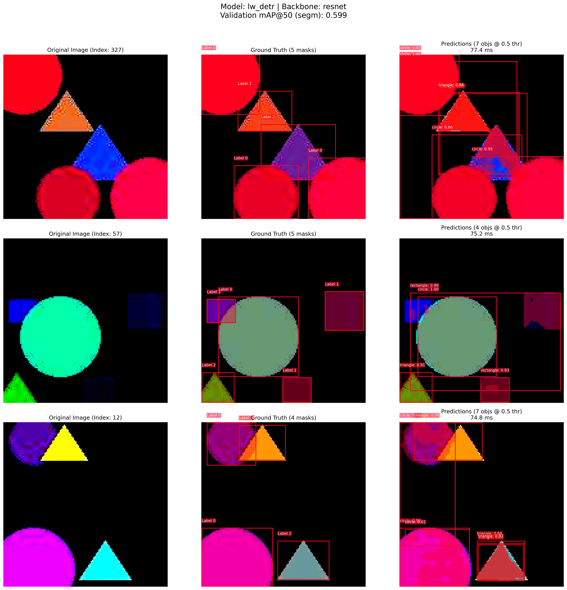
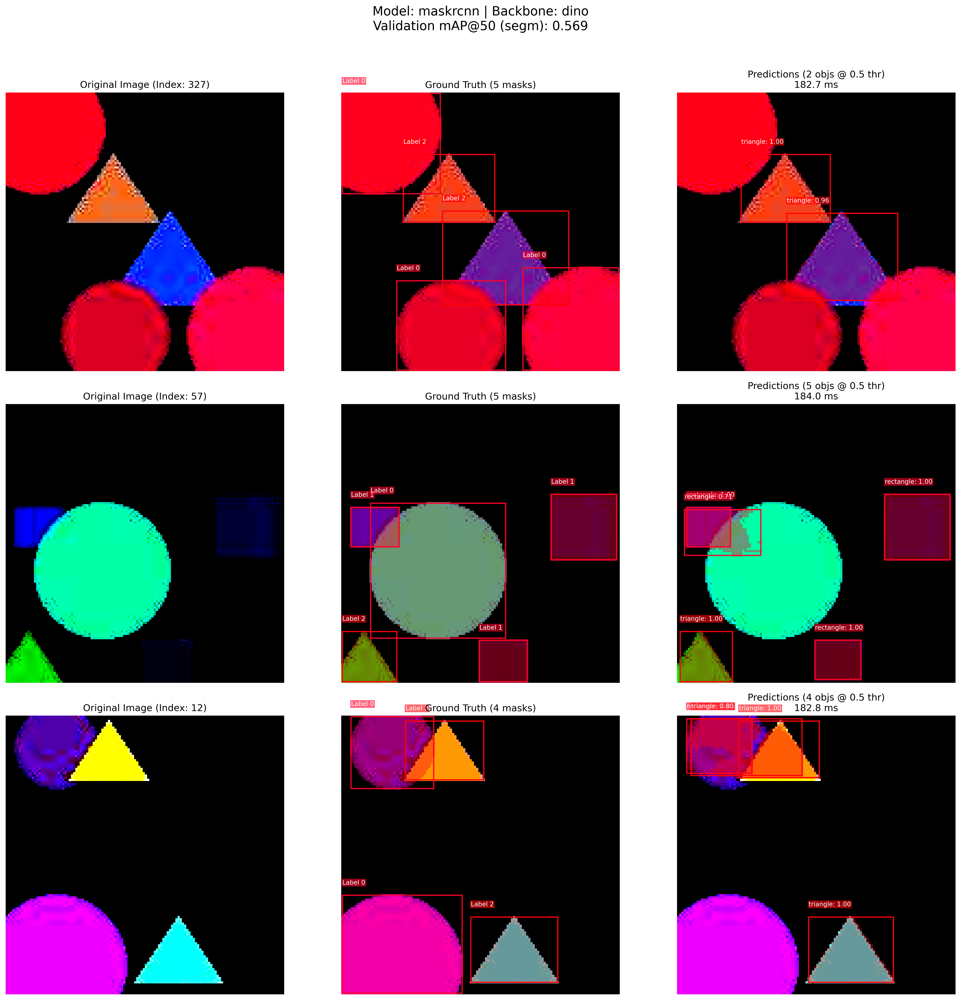
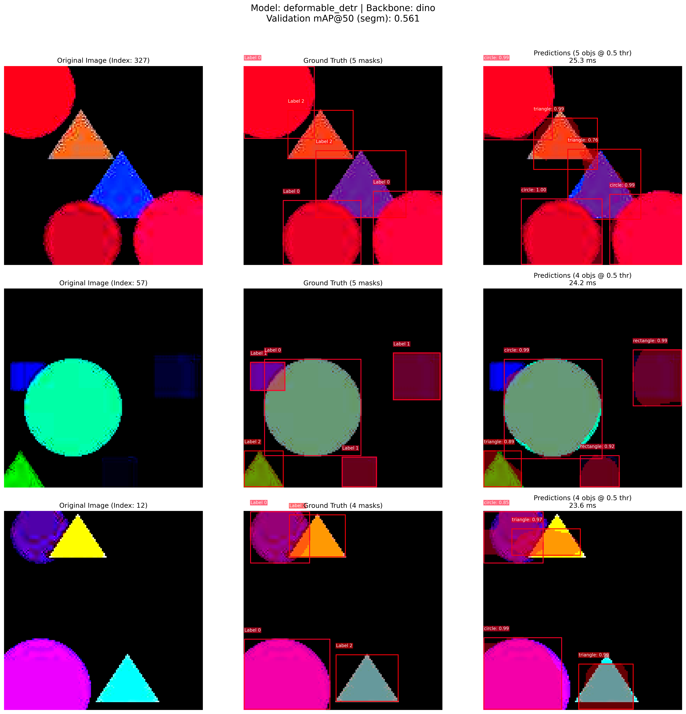
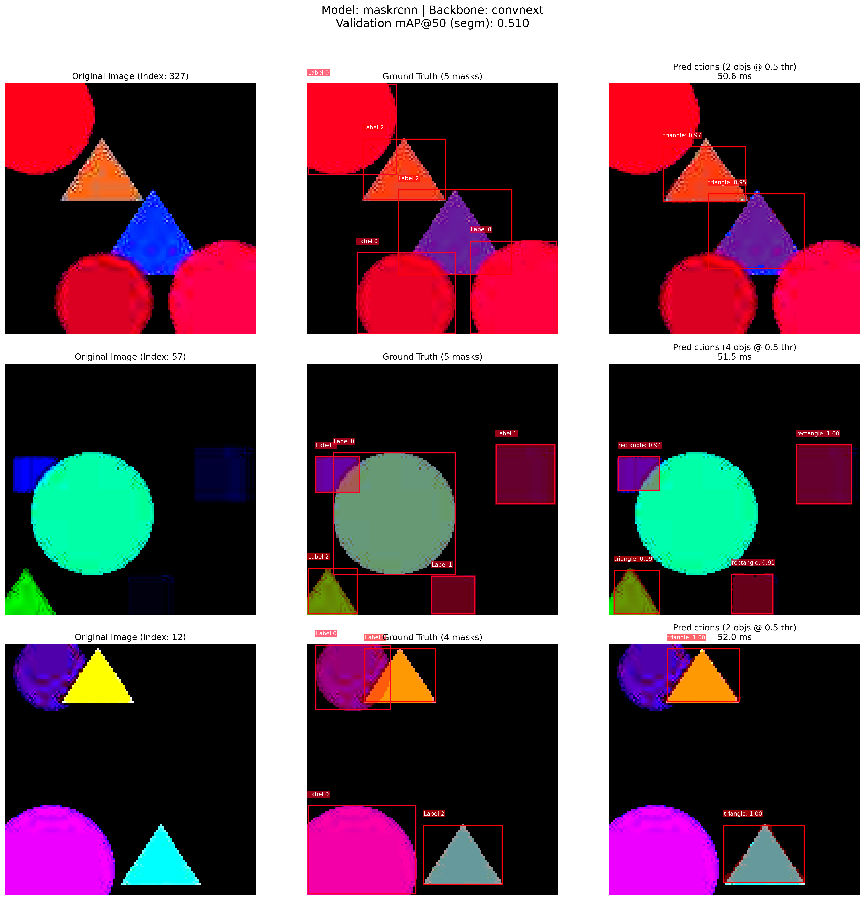
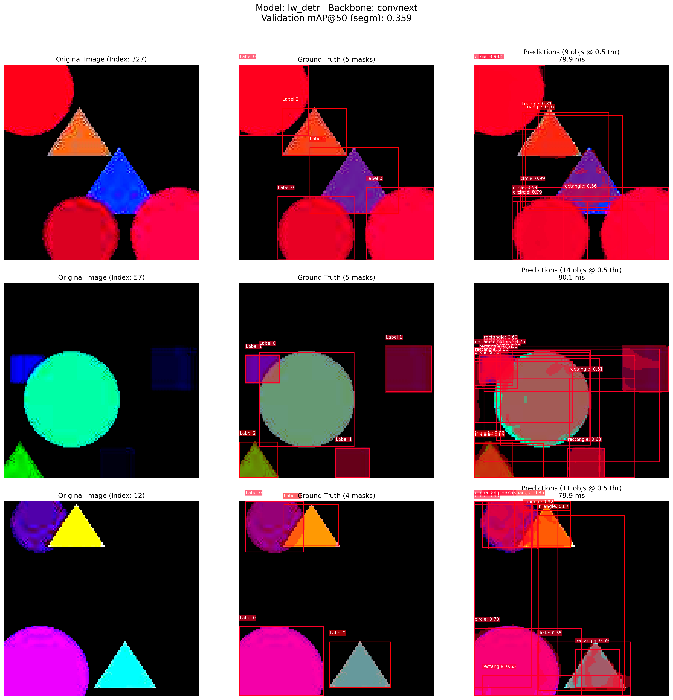
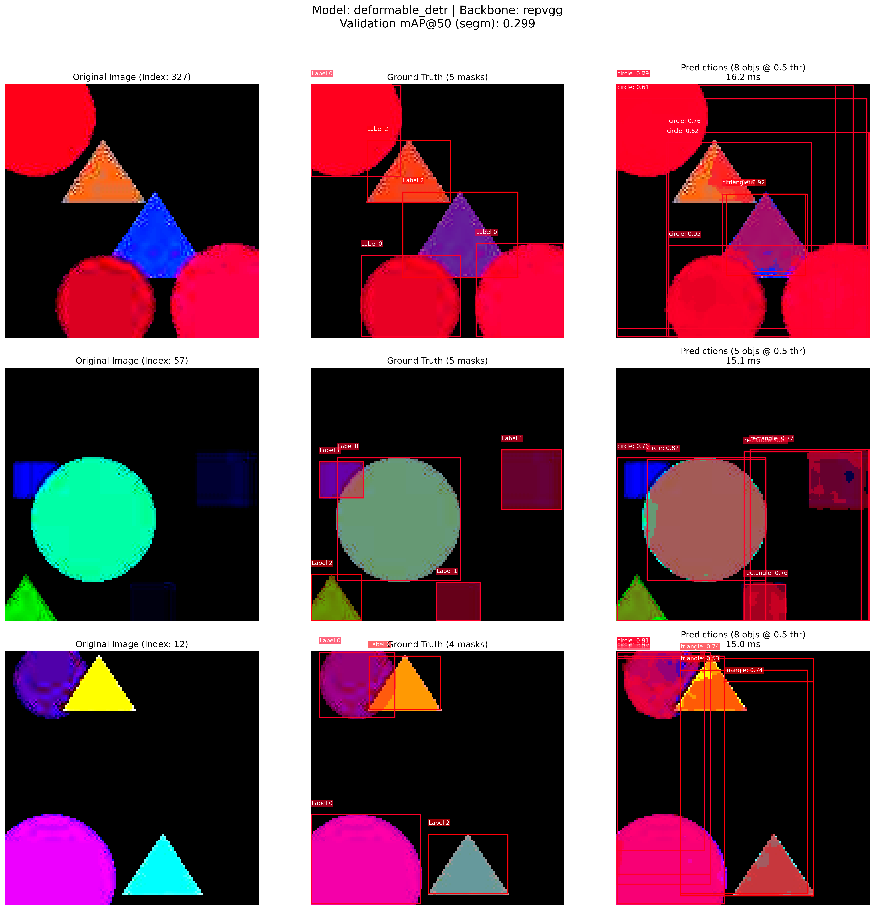
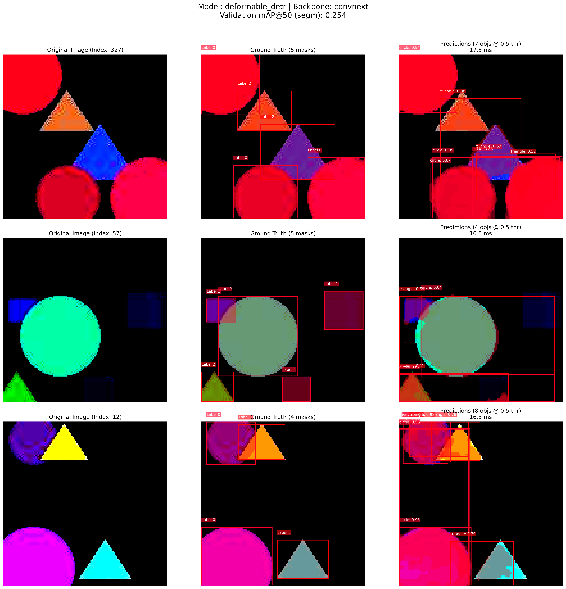
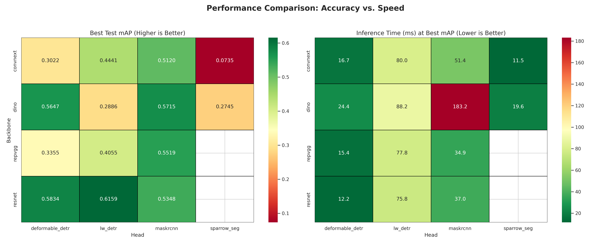

# OmniSeg

A versatile, semi-supervised instance segmentation framework built on PyTorch Lightning. OmniSeg enables training with various state-of-the-art backbones and segmentation heads on the COCO dataset. It's designed for flexibility, allowing researchers and developers to easily experiment with different model architectures and training strategies.

## ✨ Features

-   **Semi-Supervised Learning (SSL):** Leverages a teacher-student model architecture to use both labeled and unlabeled data, a crucial technique for training with limited annotations.
-   **Flexible Backbones:** Supports a wide range of popular vision models as backbones, including:
    -   **ViT:** DINOv3
    -   **CNN:** ResNet, ConvNeXt, RepVGG
    -   **Test:** Simple CNN backbone for testing and development
-   **Modular Segmentation Heads:**
    -   **Mask R-CNN:** The classic, widely-used two-stage detector.
    -   **Deformable DETR:** An advanced DETR-based instance segmentation head.
    -   **LW-DETR++:** An efficient DETR-based head designed to connect to various backbones.
    -   **Sparrow-Seg:** A custom-designed, AI-generated segmentation head balancing speed and accuracy.
-   **PyTorch Lightning:** Simplifies boilerplate code, ensures reproducibility, and supports distributed training.
-   **Automated Data Handling:** Automatically downloads and prepares the COCO 2017 dataset, or uses a tiny synthetic dataset for quick testing.

---

## 🚀 Getting Started

### Prerequisites

-   Python 3.8+
-   NVIDIA GPU with CUDA (recommended)

### Installation

Clone the repository:

```bash
git clone [https://github.com/DolosLabs/omniseg.git](https://github.com/DolosLabs/omniseg.git)
cd omniseg
````

Install dependencies:

```bash
pip install -r requirements.txt
```

Prepare the tiny dataset (recommended for testing):

```bash
python -m omniseg.utils.generate_tiny_data
```

Or prepare the COCO 2017 dataset:
The script automatically handles the download and extraction of the COCO 2017 dataset when you first run it.

-----

## 💻 Usage

To train a model, use the `train.py` script with command-line arguments.

### Basic Training

```bash
# Example 1: Quick test with a working combination
python train.py --backbone simple --head deformable_detr --use_tiny_data --fast_dev_run

# Example 2: Train with the full COCO dataset
python train.py --backbone resnet --head maskrcnn

# Example 3: Train with the tiny dataset for development
python train.py --backbone dino --head maskrcnn --image_size 64
```

### Advanced Configuration

| Argument | Type | Default | Description |
| :--- | :--- | :--- | :--- |
| `--backbone` | str | `dino` | Backbone model (e.g., `dino`, `convnext`, `repvgg`, `resnet`). |
| `--head` | str | `maskrcnn` | Segmentation head (e.g., `maskrcnn`, `deformable_detr`). |
| `--learning_rate` | float | `5e-5` | The learning rate for the optimizer. |
| `--image_size` | int | `None` | Custom image size for training and validation. |
| `--batch_size` | int | `None` | Batch size per GPU. |
| `--num_labeled_images` | int | `-1` | Number of labeled images to use (-1 for all). |
| `--num_unlabeled_images`| int | `-1` | Number of unlabeled images to use (-1 for all). |
| `--fast_dev_run` | flag | `False` | Run a single batch for testing and debugging. |
| `--warmup_steps` | int | `500` | Steps to train on labeled data only before including unsupervised loss. |
| `--unsup_rampup_steps` | int | `5000` | Steps over which to ramp up the unsupervised loss weight. |
| `--use_tiny_data` | flag | `False` | Use the tiny synthetic dataset instead of COCO. |

-----

## 📊 Results and Visualizations

Here are some sample predictions and performance metrics from different model combinations. The **test mAP** (mean Average Precision) is a key metric for instance segmentation quality.

**Experiments were run with experiment.py on 128×128 synthetic images (boxes + masks). COCO2017 tests showed convergence, but full training on all 118k images would take several days.**

 
| Backbone | Head | Epochs | Test mAP | Inference (ms) | Example Output |
| :--- | :--- | :--- | :--- | :--- | :--- |
| **ResNet** | LW-DETR | 11 | **0.599** | 75.8 |  |
| **DINO** | Mask R-CNN | 16 | **0.569** | 183.2 |  |
| **ResNet** | Deformable DETR | 13 | **0.566** | 12.2 |  |
| DINO | Deformable DETR | 129 | 0.561 | 24.4 |  |
| RepVGG | Mask R-CNN | 13 | 0.551 | 34.9 |  |
| ResNet | Mask R-CNN | 13 | 0.513 | 37.0 |  |
| ConvNext | Mask R-CNN | 13 | 0.510 | 51.4 |  |
| RepVGG | LW-DETR | 11 | 0.379 | 77.8 |  |
| ConvNext | LW-DETR | 11 | 0.359 | 80.0 |  |
| RepVGG | Deformable DETR | 13 | 0.299 | 15.4 |  |
| ConvNext | Deformable DETR | 13 | 0.254 | 16.7 |  |
| DINO | Sparrow-Seg | 79 | 0.252 | 19.6 |  |
| DINO | LW-DETR | 119 | 0.282 | 88.2 |  |

Overall Results
 
To generate your own visualizations from a checkpoint:

```bash
python visualize_model.py path/to/your/checkpoint.ckpt --backbone resnet
```

-----

## 🔧 Project Structure

```
omniseg/      # Main package (includes utilities in omniseg/utils/)
tests/        # Test modules
docs/         # Documentation
train.py
visualize_model.py
experiment.py
```

-----

## 🤝 Contributing

Contributions are welcome\! Feel free to open an issue or submit a pull request for improvements, new backbones, or segmentation heads.

-----

## 📝 Acknowledgments and Licensing

  - OmniSeg is released under the **MIT License**.
  - Component Licenses:
      - **PyTorch:** BSD-style License
      - **PyTorch Lightning:** Apache 2.0
      - **Hugging Face Transformers:** Apache 2.0
      - **timm:** Apache 2.0
      - **DINOv3:** Apache 2.0 (code)
      - **Deformable DETR:** Apache 2.0
      - **Mask R-CNN:** MIT License
  - Dataset: **COCO Dataset** (CC-BY 4.0 License)

Inspired by the **Mean Teacher** methodology.

**Contact:** Ben Harris - [https://doloslabs.com](https://doloslabs.com)
